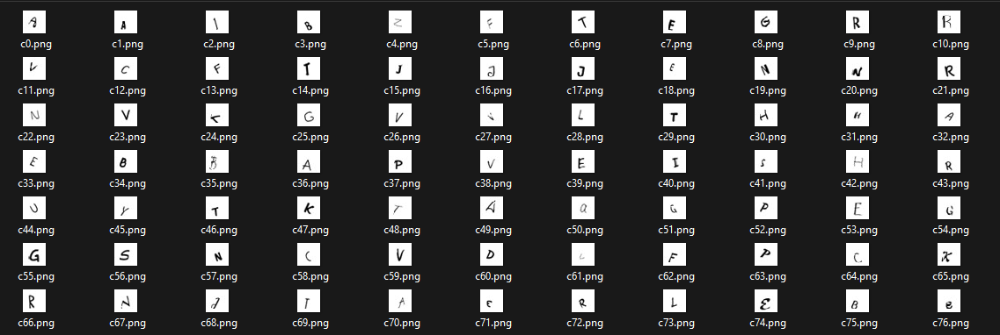

# ASCII-classification

This project provides a script for generating a pseudo handwritten dataset, using fonts and augmentation.

As an example of the dataset's performance, the project solves the Latin words classification problem using a fully connected feedforward neural network

Generated Dataset:

Test after training:

