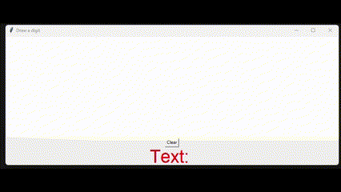

# ASCII-classification
Classifying ASCII chars using a fully connected feedforward neural network trained on a custom dataset obtained from 265 commercially free fonts.

In demo it works with 4 symbols:

